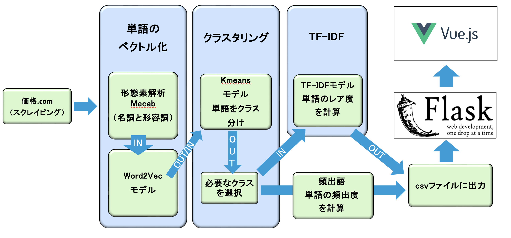

# Washingmachine_App

## 洗濯機の口コミ解析アプリ
- 洗濯機の口コミを収集し、自然言語処理を用いて解析
- 単語ごとでカテゴリーを作成し、洗濯機の写真と口コミを表示

## システム構成図

## 使用技術
### フロントエンド
- Vue3
- Vuetify3

### バックエンド
- Python
- Flask

## 参考文献
- スクレイピング
  - https://resanaplaza.com/2022/08/27/%E3%80%90python%E3%80%91%E4%BE%A1%E6%A0%BCcom%E3%81%AE%E3%83%AC%E3%83%93%E3%83%A5%E3%83%BC%E3%82%92%E3%82%B9%E3%82%AF%E3%83%AC%E3%82%A4%E3%83%97scrape%E3%81%97%E3%82%88%E3%81%86/

- 画像のスクレイピング
  - https://qiita.com/1219mai0410/items/0a7e0633291dde04b21b

- モデルの構築
  - https://qiita.com/toshiyuki_tsutsui/items/19590b464f15f845efcd

- NEologd辞書
  - https://resanaplaza.com/2022/05/08/%E3%80%90%E8%B6%85%E7%B5%B6%E7%B0%A1%E5%8D%98%E3%80%91windows-%E3%81%AEpython%EF%BC%8Bmecab%E3%81%A7%E3%83%A6%E3%83%BC%E3%82%B6%E3%83%BC%E8%BE%9E%E6%9B%B8%E3%81%ABneologd%E3%82%92%E4%BD%BF%E3%81%86/

- 不要単語除去
  - https://ohke.hateblo.jp/entry/2019/02/09/141500

- クラスタリング
  - https://qiita.com/toshiyuki_tsutsui/items/b3ac8fd1b300c3404508

- TF-IDF
  - https://www.takapy.work/entry/2019/01/14/142128

- 仮想環境
  - https://www.python.jp/install/windows/venv.html 

- Vue3
  - https://reffect.co.jp/vue
  - https://reffect.co.jp/vue/vue-js-components
  - https://reffect.co.jp/vue/beginner-vue

- Vuetify3
  - https://next.vuetifyjs.com/en/getting-started/installation/
  - https://tedate.jp/vue-js/i-tried-installing-vuetify3-1-that-called-valkyrie

- Node.jsバージョン切り替え
  - https://qiita.com/monaka33/items/2b7262b4dc91a8d1f658

- 洗濯機に求める機能
  - https://prtimes.jp/main/html/rd/p/000000759.000007815.html

## その他
- 2023年1月頃製作（学部3年）
